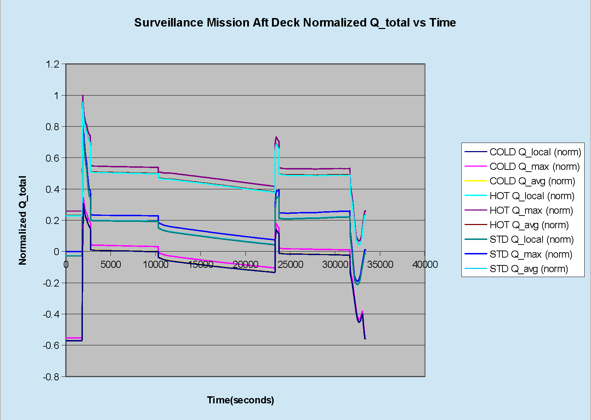

# ========================================
# Utility for Creating SINDA Convection Resistors and Heat Load Arrays from CFD Analysis Results:
# ========================================

## Utility for Creating SINDA Convection Resistors and Heat Load Arrays from CFD Analysis Results and Geometry.

##
## I. Strike Mission Aft Deck Normalized Q_total vs Time:

##
## II. Surveillance Mission Aft Deck Normalized Q_total vs Time:

##
## III. Utility for Creating SINDA Convection Resistors and Heat Load Arrays: "./bin/heat_load.exe"

##
## IV. Utility Input Files:
### IV.a. "./input/input.bdf"
### IV.b. "./input/simplified_aft_deck_grids_bottom.dat"
### IV.c. "./input/simplified_aft_deck_grids_hood.dat"
### IV.d. "./input/simplified_mesh_norm.dat"
### IV.e. "./input/strike_mission_cold_day_1976_atm.dat"
### IV.f. "./input/strike_mission_hot_day_1976_atm.dat"
### IV.g. "./input/strike_mission_std_day_1976_atm.dat"
### IV.h. "./input/surveillance_mission_cold_day_1976_atm.dat"
### IV.i. "./input/surveillance_mission_hot_day_1976_atm.dat"
### IV.j. "./input/surveillance_mission_std_day_1976_atm.dat"

##
## V. Utility Output Files:
### V.a. "./output/convec_resis.sin"
### V.b. "./output/quad_area.dat"
### V.c. "./output/output.dat"
### V.d. "./output/output.bdf"
### V.e. "./output/ignore.bdf"
### V.f. "./output/output_nodes.dat"
### V.g. "./output/output_bot.dat"
### V.h. "./output/output_hood.dat"
